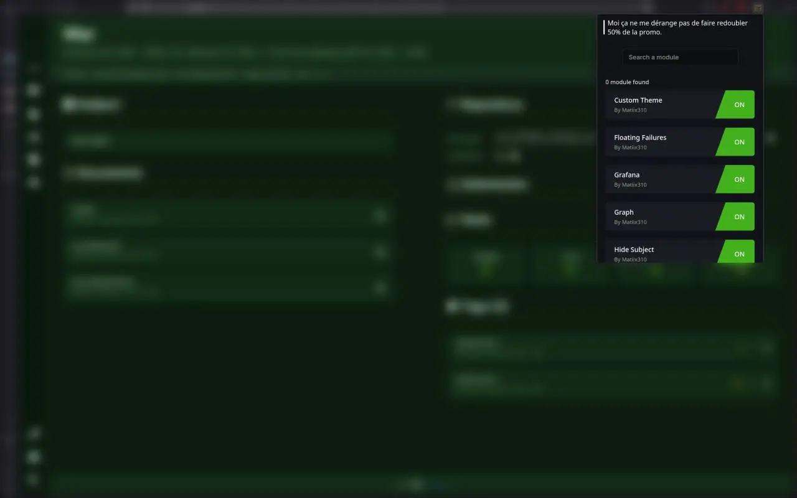

<h1 align="center">
  Intra Tweaker
</h1>


<div align="center">
    
[](https://www.typescriptlang.org/)
[](https://github.com/matiix310/intra-tweaker/releases)

</div>

## Screenshots



## Short description
Intra tweaker is a firefox extension made to improve the intranet of the EPITA school. It is composed of modules to make it easy to contribute and add completely independent features.

## Modules

- **Grafana**:
    - Grafana stats directly above the tags
- **Tags**:
    - Progress bar and ETA when a tag is running (with live data from Grafana)
    - Notification when a tag has finished running
    - Reason for why the tag was rejected
    - Auto reload when a tag is updated
- **Graph**:
    - Display the validated number of nodes (required and optional) recursively
    - No more zoom triggered with the mouse wheel
    - Display sub nodes as little bubbles below the main nodes
- **Speed**:
    - Images are blocked to speed up the loading time
- **Hide Subject**:
    - Hide the subject by default behind a "Show subject" button
- **Custom Theme**:
    - Customize the theme of the intranet with a new button in the left toolbar
        - Custom: choose your own color tint
        - Chroma: rotate along the hue spectre
- **Ongoing Tenants**:
    - Change visibility of tenants without any ongoing activity
- **Winwheel**:
    - Hide the percentage of the last tag behind a "Turn the wheel" button. When clicked, a winwheel will give you your tag percentage
- **Tag History**:
    - Add a new section named "Tag history" to the tenants page containing the last 12 tags
- **Floating Failures**:
    - Make failures float to the right so that it's always visible in a long trace

## Installation

You can download the extension in the xpi format from the [releases](https://github.com/matiix310/intra-tweaker/releases/) tab and firefox with add the extension automatically for you. You can also build the app yourself by following the `Build locally` steps below.
## Build locally

To build and run this project you need a node environment (I will use bun for the examples but fell free to use `npm`, `pnpm`, `yarn`, ...).

```sh
  git clone git@github.com:matiix310/intra-tweaker.git && \
  cd intra-tweaker && \
  bun install && \
  bun run dev
```

To build and run for firefox, you need to use the `dev:firefox` script:

```sh
  bun run dev:firefox --mv2 # for manifest v2
```

To test the extension in "production mode", you can bundle the output and load it into a chrome / firefox client from the extensions menu:

```sh
  bun run zip
  bun run zip:firefox --mv2
```

## Contributing

The extension is built from modules. Each module has its configuration in `src/entrypoints/background/modules.ts` and can have multiple files with different purpose. 
You can for example have a file injected directly in the page content (content-src) or have a file launched by the main background script (background).

The source code of the modules are located in `src/entrypoints/background/scripts/<moduleName>/<moduleFiles>` for the background scripts and in `src/entrypoints/module_<moduleName>.unlisted/` for the content scripts.

The common scripts are in `src/entrypoints/background/common/*`:
- `grafana.ts` handle the requests to the grafana server
- `graph.ts` handle the graph parsing
- `tags.ts` manages the parsing of the tags.
- `ui.ts` fetches the ui blocks from the current page (tags, tenants, subject, ...).

If you want to contribute, feel free to open a pull request or to message me on discord (@matiix310).
## Authors

- [@matiix310](https://matiix310.dev)

